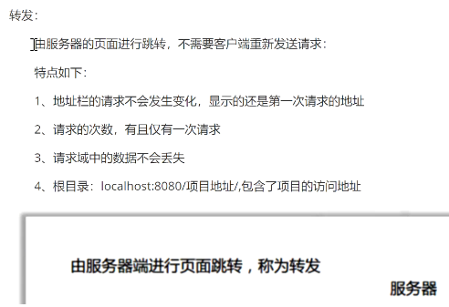
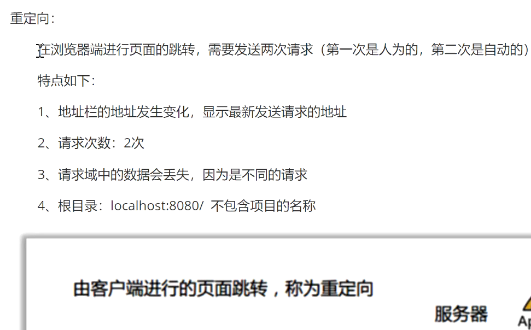

# 笔记

## Lesson35 SpringMVC源码初识

- ContextLoaderListener.java:102 (初始化Spring容器)
- HttpServletBean.java:149 (初始化SpringMVC容器)

## Lesson36 SpringMVC源码初识(二)

- ServletContext
    - servlet的上下文对象
        - 包含整个web.xml文件中的配置
- ServletConfig
    - 被某个servlet持有
        - 对应servlet中配置的属性

## Lesson37 SpringMVC源码请求执行流程

- DispatcherServlet.java:503

## Lesson38 SpringMVC源码之MultipartResolverHandlerMapping

- HandlerMapping
    - Controller
    - HttpRequestHandler
    - @Controller

## Lesson39 SpringMVC源码之HandlerMappingHandlerAdapter

- HandlerAdapter

## Lesson40 SpringMVC源码之HandlerAdapter具体执行流程

## Lesson41 SpringMVC源码之HandlerAdapter具体执行流程2

## Lesson42 SpringMVC源码之HandlerAdapter具体执行流程3

HandlerMethodArgumentResolver HandlerMethodReturnValueHandler

