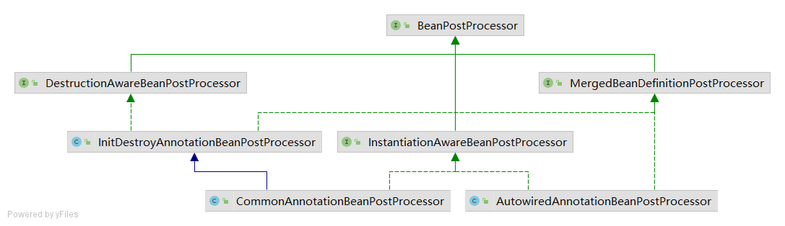
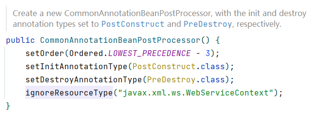
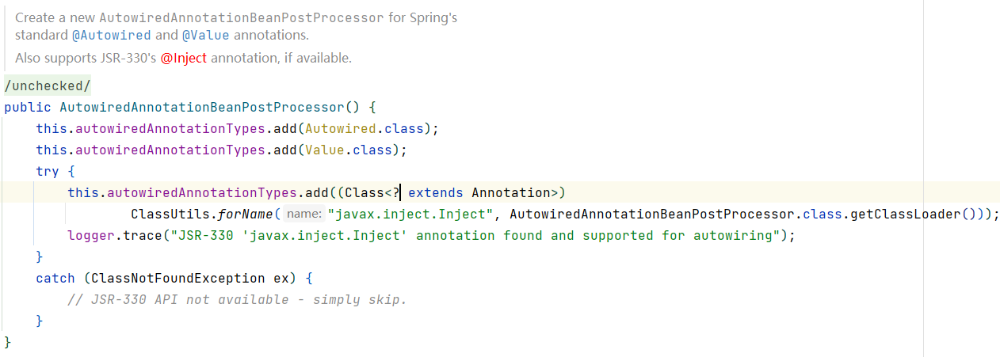

# Lesson17 spring的bean创建流程五

MergedBeanDefinitionPostProcessor

CommonAnnotationBeanPostProcessor
- Resource.class

InitDestroyAnnotationBeanPostProcessor
- PostConstruct.class 
- PreDestroy.class

AutowiredAnnotationBeanPostProcessor

- Autowired.class
- Value.class

## 初始化和循环依赖

初始化
- 填充属性
- 执行aware接口所对应的方法
- 执行BeanPostProcessor中的before方法
- 执行init-method
- 执行BeanPostProcessor中的after方法

什么时候生成代理对象
- 在进行属性注入的时候，调用该对象生成的时候检测是否需要被代理，如果需要，直接创建代理对象
- 在整个过程中，没有其它的对象有当前对象的依赖，那么在最终完整的对象生成之前生成代理对象即可（BeanPostProcessor的after方法）

提前暴露的对象
- 二级缓存(只实例化但为初始化的对象)

三级缓存的存在，对象查找的顺序 
- 1 -> 2 -> 3
- 有没有可能直接从三级缓存到一级缓存

如果单纯为了解决循环依赖问题，那么使用二级缓存足够解决问题
三级缓存存在的意义是为了避免代理，如果没有代理对象，二级缓存足以解决问题

## 课程规划

Spring -> Spring MVC -> Spring Boot -> Spring Cloud
              |               |
              V               V
           MyBatis         Tomcat 