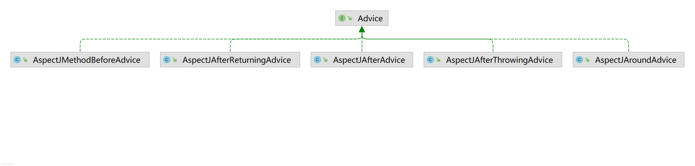

# Lesson21 springAOP的BeanDefinition的准备工作

AOP

loadBeanDefinition

AnnotationConfigUtils.java

AopConfigUtils.java

ConfigBeanDefinitionParser

AspectJPointcutAdvisor

- AspectJAroundAdvice
    - MethodLocatingFactoryBean
    - 表达式
    - SimpleBeanFactoryAwareAspectInstanceFactory
