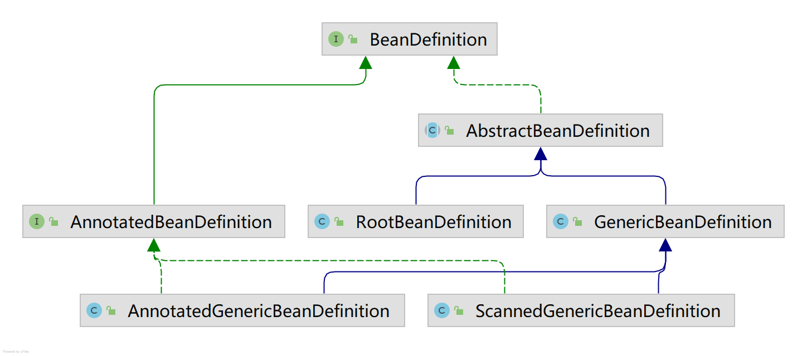

# Lesson9 spring的BeanFactoryPostProcessor的执行2

ConfigurationClassPostProcessor.java

BeanNameGenerator.java

BeanDefinition->AnnotatedBeanDefinition->ScannedGenericBeanDefinition
BeanDefinition->AbstractBeanDefinition->GenericBeanDefinition

candidateIndicators
=>
Configuration.class

Component.class
ComponentScan.class
Import.class
ImportResource.class

Bean.class
