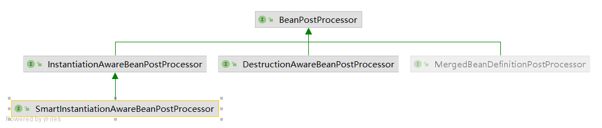

# Lesson15 spring的bean创建流程三

## 流程
getBean->doGetBean->createBean->doCreateBean

## 三级缓存
DefaultSingletonBeanRegistry

- singletonObjects
- earlySingletonObjects
- singletonFactories

## 创建对象

### 自定义BeanPostProcessor

实现接口InstantiationAwareBeanPostProcessor
的before方法postProcessBeforeInstantiation

AbstractAutowireCapableBeanFactory.java:505
Object bean = resolveBeforeInstantiation(beanName, mbdToUse);

### 通过反射
Enhancer enhancer = new Enhancer();
enhancer.setSuperclass(beanClass);
enhancer.setCallback(new MyMethodInterceptor());
enhancer.create();

### 通过factory-method

AbstractAutowireCapableBeanFactory.java:1176
return instantiateUsingFactoryMethod(beanName, mbd, args);

### 通过FactoryBean(接口规范实现)

> Lesson13  
抽象出一个接口规范，所有对象必须要通过getObject方法获取

### 通过supplier(只是BeanDefinition的一个属性值)

>随便定义创建对象方法，不局限于getObject

AbstractAutowireCapableBeanFactory.java:1170
Supplier<?> instanceSupplier = mbd.getInstanceSupplier();