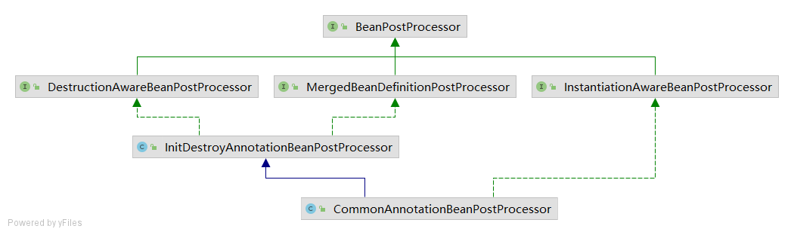

# Lesson16

AbstractAutowireCapableBeanFactory.java:1180

- 属性注入
- 构造器注入

AbstractAutowireCapableBeanFactory.java:1200
determineConstructorsFromBeanPostProcessors(beanClass, beanName);

AutowiredAnnotationBeanPostProcessor.java:258

获取构造器集合
* 如果有多个Autowired，required为true，不管有没有默认构造方法，会报异常
* 如果只有一个Autowired，required为false，没有默认构造方法，会报警告
* 如果没有Autowired注解，定义了两个及以上有参数的构造方法，没有无参构造方法，就会报错  
* 其他情况都可以，但是以有Autowired的构造方法优先，然后才是默认构造方法

实例化策略
- Simple实例化策略(SimpleInstantiationStrategy)
  - 无参构造实例化
  - 有参构造实例化
  - 工厂方法实例化
- Cglib实例化策略(CglibSubclassingInstantiationStrategy)
  - 动态代理对象
    - 无参构造
    - 有参构造

PropertyEditorRegistry lesson7
TypeConverter lesson13

AbstractAutowireCapableBeanFactory.java:568
applyMergedBeanDefinitionPostProcessors(mbd, beanType, beanName);

postProcessMergedBeanDefinition

@PostConstruct
@PreDestroy