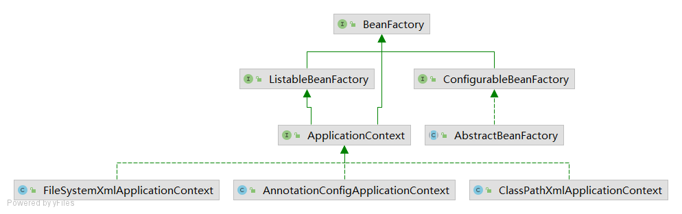

# Lesson19

AbstractAutowireCapableBeanFactory.java:1442 applyPropertyValues(beanName, mbd, bw, pvs);

## 填充属性 populateBean

1. 调用postProcessAfterInstantiation来完成属性赋值，可以直接终止后续值处理工作
    - AbstractAutowireCapableBeanFactory.java:1386 postProcessAfterInstantiation
2. 根据配置文件的autowire属性来决定是使用名称还是类型注入
    - AbstractAutowireCapableBeanFactory.java:1400 autowireByName
    - AbstractAutowireCapableBeanFactory.java:1404 autowireByType
3. 将对象中定义的@Autowire注解进行解析，完成对象的属性注入
    - AbstractAutowireCapableBeanFactory.java:1420 postProcessProperties
        - AutowiredAnnotationBeanPostProcessor
4. 根据property标签定义的属性值，完成各种属性值的解析和赋值工作
    - AbstractAutowireCapableBeanFactory.java:1442 applyPropertyValues

## 初始化 initializeBean

1. 执行调用Aware接口对应的方法
    - BeanNameAware
    - BeanClassLoaderAware
    - BeanFactoryAware
2. 执行before的初始化方法
    - ApplicationContextAwareProcessor
    - CommonAnnotationBeanPostProcessor->InitDestroyAnnotationBeanPostProcessor
        - @PostConstruct
        - @PreDestroy
3. 调用执行init-method
    - 实现了InitializingBean接口之后调用afterPropertiesSet
    - 调用执行用户自定义的初始化方法init-method
4. 执行after的初始化方法
    - AbstractAutoProxyCreator-AOP
   
## BeanFactory 

